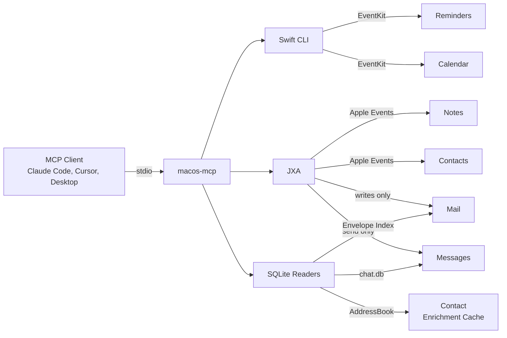

# macos-mcp  

Drive Reminders, Calendar, Notes, Mail, Messages, and Contacts on macOS from an AI agent, or from the shell.

Apple exposes three automation surfaces for these apps, and each one fails somewhere. EventKit does not reach Notes, Mail, Messages, or Contacts. JXA reads of Messages return nothing on Sonoma and later. JXA reads of Mail time out at 60 seconds against a real inbox. This project uses the bridge that works per app and documents why in [DECISION.md](DECISION.md).

| App | Reads | Writes |
|-----|-------|--------|
| Reminders | EventKit (Swift) | EventKit (Swift) |
| Calendar | EventKit (Swift) | EventKit (Swift) |
| Notes | JXA | JXA |
| Contacts | JXA | JXA |
| Mail | SQLite (`Envelope Index`) | JXA |
| Messages | SQLite (`chat.db`) | JXA |

> **Requires a Mac.** These bridges are EventKit, Apple Events, and SQLite reads of local Apple databases. There is no Linux, Windows, iOS, Android, or browser build.

## Three ways to use it

**As an MCP server.** Local stdio transport, works with any MCP-capable client on the same Mac (Claude Code, Claude Desktop, Cursor, Zed, Continue, ChatGPT desktop). Eight tools, listed under [Tools](#tools).

**As an agent skill.** The same bridges called as shell commands, with no tool schemas loaded into context. An MCP server puts all eight tool definitions in front of the model at session start whether or not the session touches a Mac app; a skill is one description line until something triggers it. See [skills/macos/](skills/macos/) for the skill, and [docs/mcp-vs-skill.md](docs/mcp-vs-skill.md) for how to choose.

**As a CLI.** `EventKitCLI` is a standalone Swift binary that speaks JSON on stdout. The JXA and SQLite recipes in the skill run anywhere a shell does.

## Quick Start

### Install as a Claude Code plugin

```
/plugin marketplace add krmj22/macos-mcp
/plugin install macos-mcp@krmj22-plugins
```

Run these inside Claude Code. The plugin wires up the MCP server via `npx -y mcp-macos`, so no separate install step is required.

### Install from npm

```bash
npm install -g mcp-macos
# or use npx via your client's MCP config (no global install needed)
```

### Or install via MCPB (Claude Desktop)

Download the `.mcpb` bundle from the [latest GitHub release](https://github.com/krmj22/macos-mcp/releases/latest) and drag it onto Claude Desktop. The bundle includes a pre-built universal Swift binary (arm64 + x86_64), so no Xcode Command Line Tools required.

### Or build from source

```bash
git clone https://github.com/krmj22/macos-mcp.git
cd macos-mcp
pnpm install
pnpm build
```

### Verify setup

```bash
macos-mcp --check   # or: node dist/index.js --check
```

Checks macOS version, Node.js, EventKit binary, Full Disk Access, and JXA automation permissions.


### Or use it as a skill instead of a server

Copy the skill into your agent's skills directory. No MCP server, no tool schemas in context.

```bash
git clone https://github.com/krmj22/macos-mcp.git
cp -R macos-mcp/skills/macos ~/.claude/skills/macos
```

The skill calls `EventKitCLI`, `osascript`, and `sqlite3` directly, so it needs the Swift binary on PATH:

```bash
cd "$(mktemp -d)" && npm i mcp-macos --no-save \
  && mkdir -p ~/.local/lib/mcp-macos/bin \
  && cp node_modules/mcp-macos/bin/EventKitCLI ~/.local/lib/mcp-macos/bin/EventKitCLI \
  && ln -sf ~/.local/lib/mcp-macos/bin/EventKitCLI ~/.local/bin/EventKitCLI
```

Same permissions apply either way. See [Permissions](#permissions).
## Tools

| Tool | App | Bridge | Actions |
|------|-----|--------|---------|
| `reminders_tasks` | Reminders | EventKit | read, create, update, delete |
| `reminders_lists` | Reminders | EventKit | read, create, update, delete |
| `calendar_events` | Calendar | EventKit | read, create, update, delete |
| `calendar_calendars` | Calendar | EventKit | read |
| `notes_items` | Notes | JXA | read, create, update, delete |
| `notes_folders` | Notes | JXA | read, create |
| `mail_messages` | Mail | SQLite + JXA | read, create, update, delete |
| `messages_chat` | Messages | SQLite + JXA | read, create |
| `contacts_people` | Contacts | JXA | read, search, create, update, delete |

Both underscore (`reminders_tasks`) and dot (`reminders.tasks`) notation work.


## Design Notes

- **SQLite for reads, JXA for writes.** JXA reads of Mail do not scale, hitting 60s timeouts on real inboxes, and JXA Messages reads are broken entirely on macOS Sonoma and later. This project reads `chat.db` and Mail's `Envelope Index` directly, including the Gmail `labels` join table for `[Gmail]/All Mail` accounts. Writes still go through JXA, because Apple Events is the only API that triggers them. See [ADR-001](DECISION.md).
- **Per-app hybrid backend.** Each app uses the bridge that works: a Swift CLI through EventKit for Reminders and Calendar, JXA for Notes, Contacts, Mail writes and Messages send, SQLite for Mail and Messages reads. The [architecture diagram](#architecture) shows the fan-out.
- **Cross-tool contact enrichment.** A shared layer resolves raw phone numbers and email addresses to contact names across Messages, Mail, and Calendar. Bulk cache via the SQLite AddressBook store, under 50ms for 1,100 entries; targeted lookups via JXA `whose()`. See [ADR-002](DECISION.md).
- **Preflight check.** `macos-mcp --check` validates macOS version, Node.js, the EventKit binary, Full Disk Access, and JXA permissions before runtime, with deep links to the relevant System Settings panes for anything that fails.
## Setup

### Prerequisites

- **Node.js 20+**
- **macOS**
- **Xcode Command Line Tools** (Swift compilation)

### Client Configuration

The JSON config is the same for all clients. Only the location differs.

```json
{
  "mcpServers": {
    "macos-mcp": {
      "command": "npx",
      "args": ["mcp-macos"]
    }
  }
}
```

| Client | Config location |
|--------|----------------|
| Claude Desktop | `claude_desktop_config.json` |
| Cursor | Settings > MCP > Add new global MCP server |
| Claude Code | `.mcp.json` in project root |

### Permissions

macOS prompts for access on first use. Click **Allow** when prompted.

| App | Permission | System Settings Path |
|-----|------------|---------------------|
| Reminders | Full Access | Privacy & Security > Reminders |
| Calendar | Full Access | Privacy & Security > Calendars |
| Notes | Automation | Privacy & Security > Automation > Notes |
| Mail | Automation + Full Disk Access | Both locations |
| Messages | Automation + Full Disk Access | Both locations |
| Contacts | Automation | Privacy & Security > Automation > Contacts |

Messages and Mail read SQLite databases directly, so your terminal app (Terminal, iTerm2, etc.) needs **Full Disk Access**.

Run `macos-mcp --check` to verify. See [Troubleshooting](#troubleshooting) if anything fails.

## Troubleshooting

### Quick-Fix Commands

```bash
# Open specific settings panes
open "x-apple.systempreferences:com.apple.preference.security?Privacy_Reminders"
open "x-apple.systempreferences:com.apple.preference.security?Privacy_Calendars"
open "x-apple.systempreferences:com.apple.preference.security?Privacy_Automation"
open "x-apple.systempreferences:com.apple.preference.security?Privacy_AllFiles"
```

### Full Disk Access (Messages & Mail)

Messages and Mail read SQLite databases (`~/Library/Messages/chat.db` and `~/Library/Mail/V10/MailData/Envelope Index`). These require Full Disk Access on your terminal app.

```bash
# Find your real node binary (version managers use shims)
node -e "console.log(process.execPath)"

# Reveal it in Finder for drag-and-drop into FDA settings
open -R "$(node -e "console.log(process.execPath)")"

# Open Full Disk Access settings
open "x-apple.systempreferences:com.apple.preference.security?Privacy_AllFiles"
```

**Version manager users** (Volta, nvm, fnm): the `node` command is a shim. System Settings needs the real binary:

| Manager | Find real binary |
|---------|-----------------|
| Volta | `volta which node` |
| nvm | `nvm which current` |
| fnm | `fnm exec -- node -e "console.log(process.execPath)"` |

System Settings may not show binaries in hidden directories. Use `open -R` above to reveal it in Finder, then drag into the FDA list.

### JXA Automation (Notes, Mail, Contacts)

On first use, macOS prompts for Automation access. Grant via **System Settings > Privacy & Security > Automation**.

Verify permissions:

```bash
osascript -l JavaScript -e 'Application("Contacts").people().length'
osascript -l JavaScript -e 'Application("Calendar").calendars().length'
osascript -l JavaScript -e 'Application("Reminders").defaultList().name()'
osascript -l JavaScript -e 'Application("Mail").inbox().messages().length'
osascript -l JavaScript -e 'Application("Notes").notes().length'
```

Each command should return a value. A hang means the permission dialog is trying (and failing) to appear.

### Gmail Labels / Missing Inbox Messages

Gmail stores all messages in `[Gmail]/All Mail` and uses labels for folder membership. The server checks both the direct mailbox and labels join table. If Gmail inbox messages are missing, verify the Mail app has fully synced.

## Development

```bash
pnpm install          # Install dependencies
pnpm build            # Build TypeScript + Swift binary
pnpm test             # Run full test suite
pnpm lint             # Lint and format (Biome + TypeScript)
pnpm dev              # Run from source via tsx
```

Production entry point (`bin/run.cjs`) requires `pnpm build`. Use `pnpm dev` for local development.

### Architecture



Three bridges to Apple apps:

- **EventKit (Swift binary).** Reminders, Calendar. Compiled Swift CLI, returns JSON.
- **JXA.** Notes, Mail writes, Contacts. Scripts run via `osascript -l JavaScript`.
- **SQLite.** Messages reads (`~/Library/Messages/chat.db`), Mail reads (`~/Library/Mail/V10/MailData/Envelope Index`). JXA message reading is broken on Sonoma and later. JXA mail reading is too slow for real inboxes.

Mail and Messages use a hybrid path: JXA for writes (only way to trigger send/draft), SQLite for reads (the only way that scales). See [DECISION.md](DECISION.md) for architecture decision records.

### Dependencies

**Runtime:** `@modelcontextprotocol/sdk`, `zod`

**Dev:** `typescript`, `tsx`, `jest`, `@biomejs/biome`


## Credits

The MCP server layer started from [FradSer/mcp-server-apple-events](https://github.com/FradSer/mcp-server-apple-events) (MIT). The EventKit Swift CLI, the SQLite read paths, contact enrichment, the preflight check, and the skill surface were added here.

## License

MIT

## Contributing

See [CONTRIBUTING.md](CONTRIBUTING.md).
