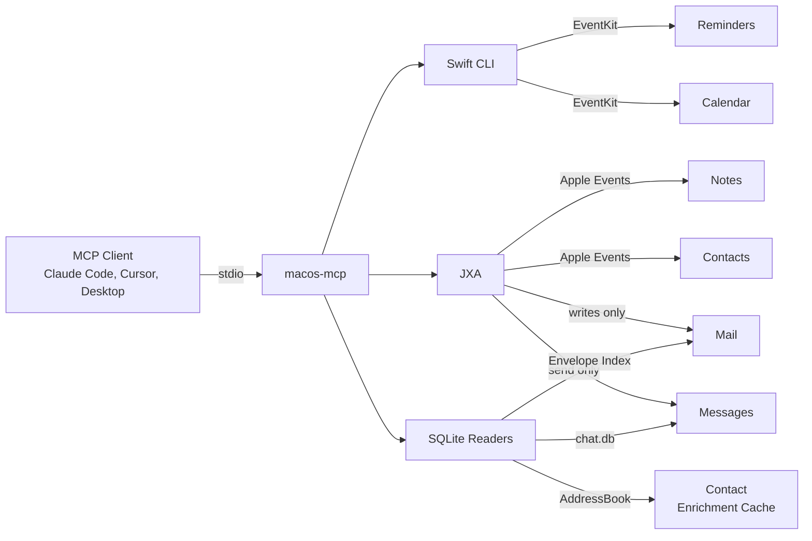

# macos-mcp  

> Based on [FradSer/mcp-server-apple-events](https://github.com/FradSer/mcp-server-apple-events)

MCP server for Reminders, Calendar, Notes, Mail, Messages, and Contacts on macOS. Local stdio transport — works with any MCP-capable client running on the same Mac (Claude Code, Claude Desktop, Cursor, Zed, Continue, ChatGPT desktop, etc.).

> **Requires a Mac.** This server drives native macOS apps via EventKit, JXA (Apple Events), and SQLite reads of local Apple databases. It cannot run on Linux, Windows, iOS, Android, or in a web browser. You need a Mac (desktop or laptop) running macOS.

## Quick Start

### Install from npm

```bash
npm install -g mcp-macos
```

### Or build from source

```bash
git clone https://github.com/krmj22/macos-mcp.git
cd macos-mcp
pnpm install
pnpm build
```

### Verify setup

```bash
macos-mcp --check   # or: node dist/index.js --check
```

Checks macOS version, Node.js, EventKit binary, Full Disk Access, and JXA automation permissions.

## Tools

| Tool | App | Bridge | Actions |
|------|-----|--------|---------|
| `reminders_tasks` | Reminders | EventKit | read, create, update, delete |
| `reminders_lists` | Reminders | EventKit | read, create, update, delete |
| `calendar_events` | Calendar | EventKit | read, create, update, delete |
| `calendar_calendars` | Calendar | EventKit | read |
| `notes_items` | Notes | JXA | read, create, update, delete |
| `notes_folders` | Notes | JXA | read, create |
| `mail_messages` | Mail | SQLite + JXA | read, create, update, delete |
| `messages_chat` | Messages | SQLite + JXA | read, create |
| `contacts_people` | Contacts | JXA | read, search, create, update, delete |

Both underscore (`reminders_tasks`) and dot (`reminders.tasks`) notation work.

## Setup

### Prerequisites

- **Node.js 20+**
- **macOS**
- **Xcode Command Line Tools** (Swift compilation)

### Client Configuration

The JSON config is the same for all clients — just the location differs.

```json
{
  "mcpServers": {
    "macos-mcp": {
      "command": "npx",
      "args": ["mcp-macos"]
    }
  }
}
```

| Client | Config location |
|--------|----------------|
| Claude Desktop | `claude_desktop_config.json` |
| Cursor | Settings > MCP > Add new global MCP server |
| Claude Code | `.mcp.json` in project root |

### Permissions

macOS prompts for access on first use. Click **Allow** when prompted.

| App | Permission | System Settings Path |
|-----|------------|---------------------|
| Reminders | Full Access | Privacy & Security > Reminders |
| Calendar | Full Access | Privacy & Security > Calendars |
| Notes | Automation | Privacy & Security > Automation > Notes |
| Mail | Automation + Full Disk Access | Both locations |
| Messages | Automation + Full Disk Access | Both locations |
| Contacts | Automation | Privacy & Security > Automation > Contacts |

Messages and Mail read SQLite databases directly, so your terminal app (Terminal, iTerm2, etc.) needs **Full Disk Access**.

Run `macos-mcp --check` to verify. See [Troubleshooting](#troubleshooting) if anything fails.

## Troubleshooting

### Quick-Fix Commands

```bash
# Open specific settings panes
open "x-apple.systempreferences:com.apple.preference.security?Privacy_Reminders"
open "x-apple.systempreferences:com.apple.preference.security?Privacy_Calendars"
open "x-apple.systempreferences:com.apple.preference.security?Privacy_Automation"
open "x-apple.systempreferences:com.apple.preference.security?Privacy_AllFiles"
```

### Full Disk Access (Messages & Mail)

Messages and Mail read SQLite databases (`~/Library/Messages/chat.db` and `~/Library/Mail/V10/MailData/Envelope Index`). These require Full Disk Access on your terminal app.

```bash
# Find your real node binary (version managers use shims)
node -e "console.log(process.execPath)"

# Reveal it in Finder for drag-and-drop into FDA settings
open -R "$(node -e "console.log(process.execPath)")"

# Open Full Disk Access settings
open "x-apple.systempreferences:com.apple.preference.security?Privacy_AllFiles"
```

**Version manager users** (Volta, nvm, fnm): the `node` command is a shim. System Settings needs the real binary:

| Manager | Find real binary |
|---------|-----------------|
| Volta | `volta which node` |
| nvm | `nvm which current` |
| fnm | `fnm exec -- node -e "console.log(process.execPath)"` |

System Settings may not show binaries in hidden directories — use `open -R` above to reveal it in Finder, then drag into the FDA list.

### JXA Automation (Notes, Mail, Contacts)

On first use, macOS prompts for Automation access. Grant via **System Settings > Privacy & Security > Automation**.

Verify permissions:

```bash
osascript -l JavaScript -e 'Application("Contacts").people().length'
osascript -l JavaScript -e 'Application("Calendar").calendars().length'
osascript -l JavaScript -e 'Application("Reminders").defaultList().name()'
osascript -l JavaScript -e 'Application("Mail").inbox().messages().length'
osascript -l JavaScript -e 'Application("Notes").notes().length'
```

Each command should return a value. A hang means the permission dialog is trying (and failing) to appear.

### Gmail Labels / Missing Inbox Messages

Gmail stores all messages in `[Gmail]/All Mail` and uses labels for folder membership. The server checks both the direct mailbox and labels join table. If Gmail inbox messages are missing, verify the Mail app has fully synced.

## Development

```bash
pnpm install          # Install dependencies
pnpm build            # Build TypeScript + Swift binary
pnpm test             # Run full test suite
pnpm lint             # Lint and format (Biome + TypeScript)
pnpm dev              # Run from source via tsx
```

Production entry point (`bin/run.cjs`) requires `pnpm build`. Use `pnpm dev` for local development.

### Architecture



Three bridges to Apple apps:

- **EventKit (Swift binary)** — Reminders, Calendar. Compiled Swift CLI, returns JSON.
- **JXA** — Notes, Mail writes, Contacts. Scripts run via `osascript -l JavaScript`.
- **SQLite** — Messages reads (`~/Library/Messages/chat.db`), Mail reads (`~/Library/Mail/V10/MailData/Envelope Index`). JXA message reading is broken on Sonoma+; JXA mail reading is too slow for real inboxes.

Mail and Messages use a hybrid path: JXA for writes (only way to trigger send/draft), SQLite for reads (the only way that scales). See [DECISION.md](DECISION.md) for architecture decision records.

### Dependencies

**Runtime:** `@modelcontextprotocol/sdk`, `zod`

**Dev:** `typescript`, `tsx`, `jest`, `@biomejs/biome`

## License

MIT

## Contributing

See [CONTRIBUTING.md](CONTRIBUTING.md).
